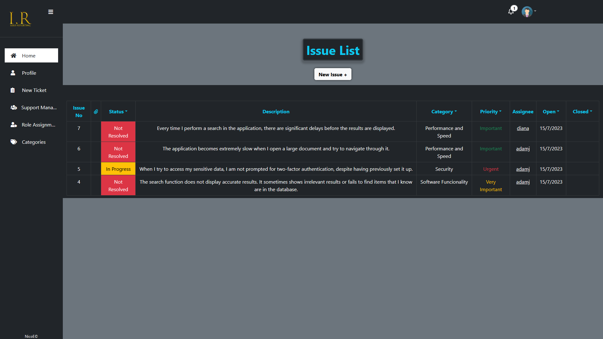

         

# ISSUE-REPORTING-APP

[issue-reporting-app.netlify.app](https://issue-reporting-app.netlify.app)

-Aplicación web creada con React.js.

-La idea de esta aplicación es ofrecer a un usuario regular autenticado, la generación de reportes de problemas referidos a una categoría dada(seleccionable entre varias categorías precargadas en dicha aplicación), este reporte origina un "ticket" con los datos del problema, que será recibido por un usuario autenticado con el rol de "soporte", quien se encargará de dar seguimiento y respuesta a estos reportes. Así mismo se dispone de un usuario autenticado con rol de "administrador", quien podrá tener funciones varias, tales como: la creación de reportes, el seguimiento de tickets, la gestión de categorías, la asignación de roles de usuario, entre otras.

## Dependencias 

-auth0 (autenticación y autorización)  
-fontawesome (iconos)  
-axios (fetching de datos)  
-bootstrap (diseño responsive)  
-cdbreact (sidebar)  
-chart.js (gráfico de datos)  
-date-fns (filtrado de fechas)  
-react(create-react-app)  
-react-bootstrap (diseño responsive)  
-react-chartsjs-2 (graáfico de datos)  
-react-date-range (filtrado por fechas)  
-react-dom  
-react-hook-form (manejo de formularos)  
-react-router-bootstrap (integración de react-bootstrap con react-router-dom)  
-react-router-dom (manejo de rutas de navegación)  
-react-scripts  

## Licencia 

## Estado del proyecto 

## Creador

### NicoDev

  
  
[Nico-Portfolio](https://nico-portfolio.netlify.app/)  

